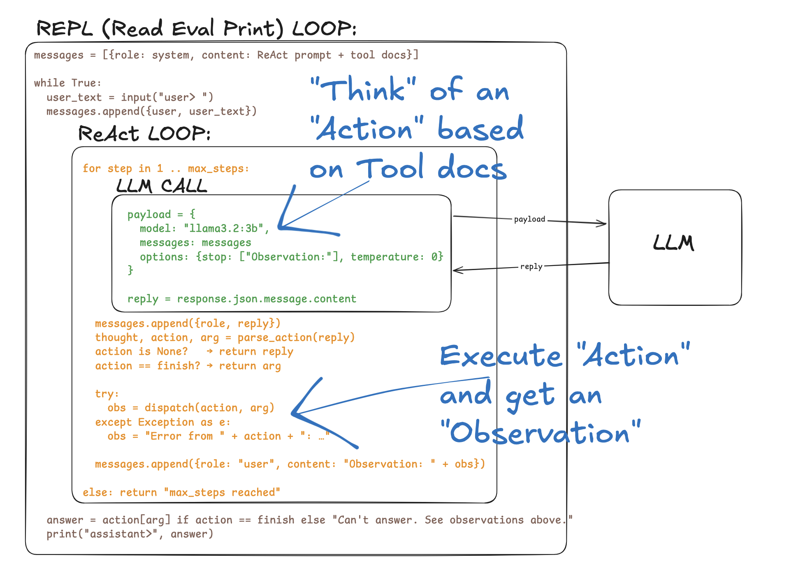

# Local ReAct Agent

A minimal, "hand-built" ReAct agent that talks to OpenAI's Chat Completions
API. Four short Python files, no SDK abstractions over the loop — every
tool call is requested through OpenAI function calling and dispatched manually.

It also works with OpenAI-compatible gateways or local servers by overriding
`OPENAI_BASE_URL`.

## Pseudo Code



## What this teaches

- **Chat API roles** — every message is tagged `system` / `user` /
  `assistant` / `tool`. Tool outputs are returned with the matching
  `tool_call_id`.
- **Function calling** — tools are exposed as JSON schemas. The model returns
  structured `tool_calls`; the Python loop executes them and sends the outputs
  back as `role: tool` messages.
- **Prompt-as-history** — the LLM is stateless. The full `messages` list is
  re-sent every turn. That's literally the "context window" filling up.
- **Inner vs outer loop** — the outer loop is multi-turn conversation
  (`repl.py`). The inner loop is the ReAct iteration within one user turn
  (`react.py`). They're two distinct loops doing different jobs.
- **Tool dispatch** — `tools.TOOLS` is a single dict mapping name → function
  metadata. Adding a tool is one entry plus its JSON schema.
- **No SDK wrapper** — the agent loop is hand-built on top of raw HTTP calls
  to Chat Completions.

## Files

| File | Lines | What it does |
|---|---|---|
| `llm.py` | ~100 | One pure function: `chat(messages, tools)` → assistant message |
| `tools.py` | ~130 | tool schemas, `calculate`, `web_search`, `dispatch` |
| `react.py` | ~80 | `SYSTEM_PROMPT`, tool-call loop, `agent_turn` |
| `repl.py` | ~55 | Multi-turn REPL with `/clear`/`/history` commands |
| `responses_llm.py` | ~70 | Optional OpenAI Responses API HTTP wrapper |
| `responses_agent.py` | ~85 | Optional Responses API tool-call loop |
| `responses_repl.py` | ~40 | Optional Responses API REPL |
| `requirements.txt` | 2 | `httpx`, `ddgs` |

## Prereqs

- Python 3.10+
- An OpenAI API key

## One-time setup

```bash
export OPENAI_API_KEY="your-openai-api-key"
export OPENAI_MODEL="gpt-4o-mini"
```

`OPENAI_BASE_URL` defaults to `https://api.openai.com/v1`, so you normally do
not need to set it. For a local OpenAI-compatible server, point
`OPENAI_BASE_URL` at its `/v1` base URL and set `OPENAI_MODEL` to the local
model name.

## Per-session setup

```bash
cd /path/to/agent-loop
python3 -m venv .venv
source .venv/bin/activate
pip install -r requirements.txt
```

## Run

```bash
python -m repl
```

## Responses API Variant

The default `repl.py` uses Chat Completions because it works with OpenAI and
many OpenAI-compatible providers. There is also a separate Responses API demo:

```bash
python -m responses_repl
```

Responses API differs from Chat Completions in a few important ways:

- The endpoint is `/v1/responses` instead of `/v1/chat/completions`.
- The model can return `function_call` output items instead of assistant
  messages with `tool_calls`.
- Tool results are sent back as input items with
  `type: "function_call_output"` and the matching `call_id`.
- Multi-turn state can be continued with `previous_response_id`, so the REPL
  does not need to resend a local `messages` array for every follow-up.
- OpenAI also exposes built-in tools through Responses API, while this demo
  only uses local function tools for parity with the Chat Completions version.

Provider support is not universal. DeepSeek's public docs describe
OpenAI-compatible `/chat/completions` and function calling there, but not
OpenAI's `/responses` endpoint. Use the default `python -m repl` path for
DeepSeek unless DeepSeek adds `/responses` support.

Validation note: `responses_repl.py` has been manually verified with
`doubao-seed-2-0-lite-260428` on a Responses-compatible endpoint. The run
confirmed `previous_response_id` continuation, local function calls,
`function_call_output` tool result handoff, and a follow-up Chinese summary
that reused prior context. A multi-tool-call case was also verified: one model
response returned two `calculate` calls, both were executed locally, and their
outputs were sent back together before the final answer.

For a detailed breakdown of how Chat Completions assembles `messages` versus
how Responses API uses `input` and `previous_response_id`, see
[`docs/session-notes.md`](docs/session-notes.md#prompt-construction).

### REPL commands

Typed at the `user>` prompt. Handled by `repl.py`, never sent to the model.

| Command | Effect |
|---|---|
| `quit` / `exit` / Ctrl-D | Leave the REPL |
| `/clear` | Drop the conversation history (keeps the system prompt) |
| `/history` | Dump every message in the current context, indexed and role-tagged |

Anything else is treated as a user question and triggers one `agent_turn`.

Sample session:

```
user> add 100 to the year of the last presidential election in Chile               
  [step 1] tool_calls: 1
  [step 1] tool: web_search({"query":"last presidential election in Chile"})
  [step 1] result: - 2025 Chilean general election - Wikipedia: General elections were held in Chile on 16 November 2025...
  [step 2] tool_calls: 1
  [step 2] tool: calculate({"expression":"2025 + 100"})
  [step 2] result: 2125
  [step 3] final

assistant> 2125

user> divide that by 5
  [step 1] tool_calls: 1
  [step 1] tool: calculate({"expression":"2125 / 5"})
  [step 1] result: 425.0
  [step 2] final

assistant> 425.0

user> /clear
(history cleared)
```

## Customize

- **Add a tool** — add one entry to `tools.TOOLS` with `fn`, `description`,
  and `parameters`. The OpenAI tool schema is generated from it.
- **Swap the model** — set `OPENAI_MODEL` before running the REPL.
- **Swap the endpoint** — set `OPENAI_BASE_URL` to another compatible `/v1`
  base URL.
- **More steps** — raise `max_steps` in `agent_turn` (default 8).
- **Less deterministic** — raise `temperature` in the `chat` call (default 0).

## Planned Features

This project is intentionally small, but the next useful upgrades are:

- **Focused tests** — cover `tool_specs()`, `dispatch()`, the tool-call loop,
  tool errors, multiple tool calls in one assistant message, and final-answer
  handling.
- **Structured tool results** — return JSON strings such as
  `{"ok": true, "result": "300"}` or `{"ok": false, "error": "..."}` instead
  of plain text, so the model can distinguish successful outputs from errors.
- **Run traces** — record each step as structured data: step number, tool name,
  arguments, output preview, and final answer. Keep the REPL concise while
  preserving a full debug log for teaching and inspection.
- **More practical tools** — add examples such as `fetch_url(url)`,
  `arxiv_search(query)`, `current_time()`, `read_file(path)`, or
  `write_note(title, content)`.
- **Responses API parity** — expand the separate Responses API demo with
  streaming, tracing, and feature comparisons against Chat Completions.
- **Prompt-injection hardening** — treat web/search outputs as untrusted data,
  wrap tool outputs in structured envelopes, and tell the model not to follow
  instructions found inside tool results.

## Troubleshooting

- `401 Unauthorized`: `OPENAI_API_KEY` is missing or invalid for the selected
  provider.
- `404 Not Found`: `OPENAI_BASE_URL` is probably wrong. Use the provider's
  `/v1` base URL, not a dashboard URL.
- `httpx.ConnectError`: the configured endpoint is unreachable.
- Model never calls tools: confirm the model supports Chat Completions tool
  calling and that `OPENAI_MODEL` is set to a tool-capable model.
- Tool raises an exception: caught and reported as
  a tool output like `Error from <tool>: <message>` so the model can react.
- Answers are not logical: try a stronger `OPENAI_MODEL`.
